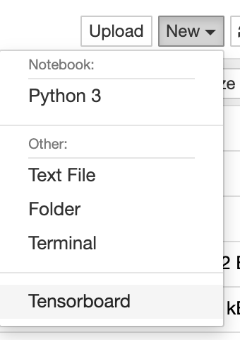
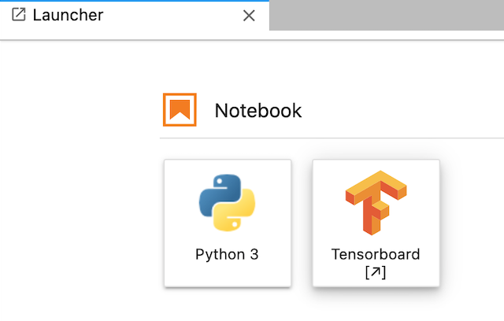

# jupyter-tensorboard-proxy
Tensorboard proxy plugin for jupyter-server-proxy.This package was built from the [`illumidesk/cookiecutter-jupyter-server-proxy`](https://github.com/illumidesk/cookiecutter-jupyter-server-proxy) template.

## Usage

Here is how to use the jupyter-tensorboard-proxy in Jupyter notebook and JupyterLab.

### Jupyter notebook

You can launch the new page of Tensorboard by clicking the "Tensorboard" item in dropdown menu.


### Jupyterlab

You can launch the Tensorboard page by clicking "Tensorboard" icon in launcher page.



## Requirements

- Python 3.7+
- Jupyter Notebook 6.0+
- JupyterLab 3.0+
- Jupyter Server Proxy 1.5+

This package executes the standard `tensorboard` command. This command assumes the `tensorboard` command is available in the environment's `PATH`.

## Development

```bash
python3 -mvenv venv
source venv/bin/activate
```

## Deployment
Here describes how to deploy tensorboad proxy.

### Install jupyter-tensorboard-proxy

```bash
pip install jupyter-tensorboard-proxy
```

### Enable jupyter-tensorboard-proxy Extensions

1. For Jupyter Classic, activate the `jupyter-server-proxy` extension:

```bash
jupyter serverextension enable --sys-prefix jupyter_server_proxy
```

2. For Jupyter Lab, install the `@jupyterlab/server-proxy` extension:

```bash
jupyter labextension install @jupyterlab/server-proxy
jupyter lab build
```